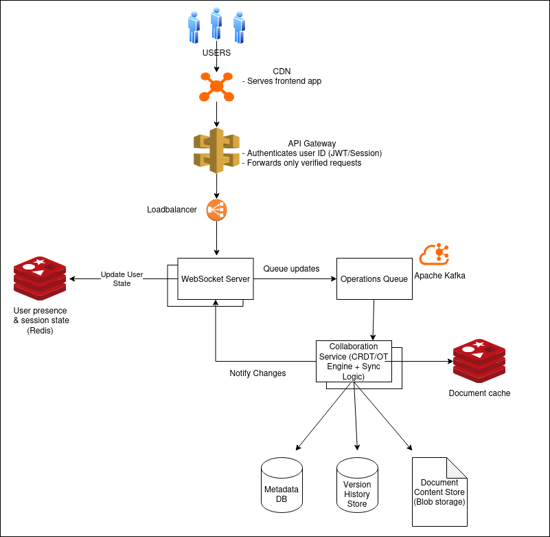

# Real-time Collaborative Document Editing System

This is my first time creating a design of a system. I know there are some amendments that can be made, e.g. better tools, designs, etc. to make this system more reliable, scalable, cost-effective, and so on. But this is the system I have designed based on my current knowledge:

